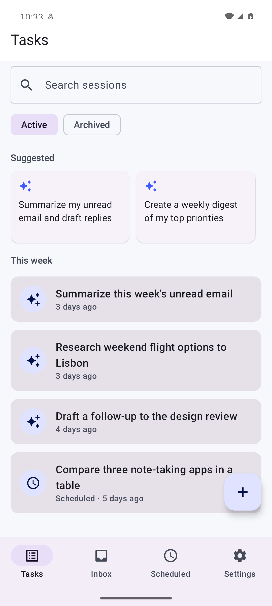
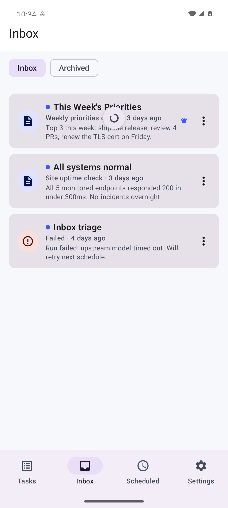
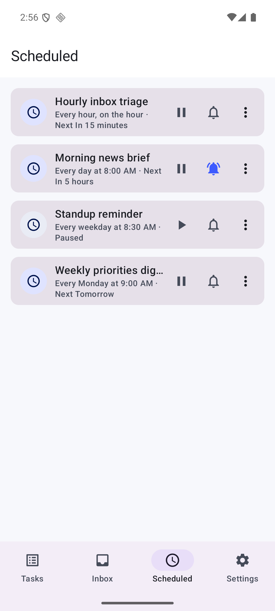
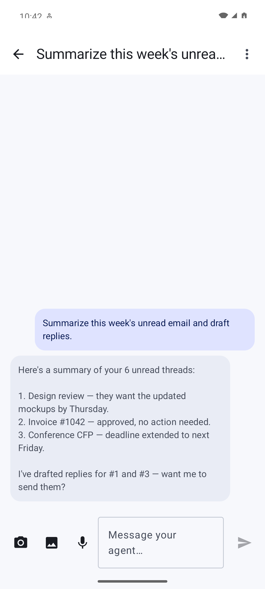
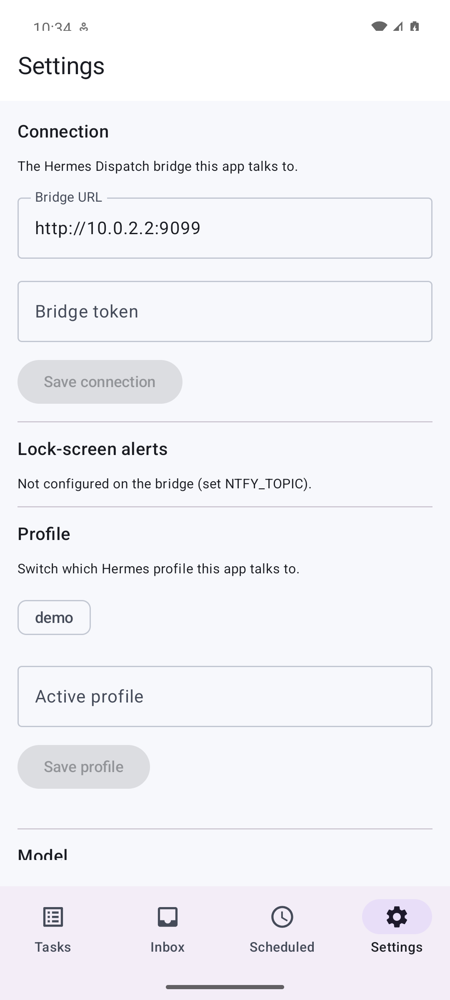

# Hermes Dispatch

**An open-source, mobile-first Android app for your [Hermes](https://github.com/NousResearch/hermes-agent) agents.**
Fire off tasks by voice or text, watch your self-hosted agent work in real time, control its scheduled jobs, and get progress on your lock screen — all from your phone.

[](LICENSE)
[](https://ko-fi.com/andrew65386)

> 💜 **Enjoying Hermes Dispatch?** [**☕ Support development on Ko-fi →**](https://ko-fi.com/andrew65386) — donations fund new features and keep the project alive.

### 📲 Download
**[⬇️ Latest release APK](https://github.com/adebnar/hermes-dispatch-android/releases/latest)** — grab `hermes-dispatch-oss.apk` from the latest stable release and install it (you'll need to allow "install from unknown sources").

> Stable: <https://github.com/adebnar/hermes-dispatch-android/releases/latest/download/hermes-dispatch-oss.apk>
> Beta (pre-release, from `development`): grab `hermes-dispatch-oss-beta.apk` from the newest **pre-release** on the [releases page](https://github.com/adebnar/hermes-dispatch-android/releases). The beta is a **separate app** ("Hermes Dispatch Beta", id `…​.beta`) that installs **alongside** the stable one, so you can try new builds without losing your setup.

The `oss` build is Google-library-free (F-Droid-friendly) and uses [ntfy](https://ntfy.sh)/UnifiedPush for background notifications.

## Screenshots

| Tasks | Inbox | Scheduled | Chat | Settings |
|---|---|---|---|---|
|  |  |  |  |  |

<sub>Screenshots use synthetic demo data.</sub>

## Features
- 📋 **Tasks dashboard** — a **quick-action bar** (voice / image / document / clipboard), an **All · Scheduled · Completed** segmented filter, and animated run-state icons (running / done / failed). History with live status, **search**, **swipe to archive** (with Undo), open for the full conversation, **rename**, or **long-press a sent message to edit & resend**.
- 🗣️📷📎 **Multi-modal task creation** — **voice** (on-device or server STT) in a sheet with a live amplitude **waveform**; **camera / gallery images**; **document attach** (PDF / CSV / text — uploaded to your Hermes so the agent can read it); and **clipboard** quick-paste.
- ⏰ **Scheduled** — recurring (cron) jobs your agent classifies, shown in **plain English** ("Every weekday at 9:00 AM") with a next-run countdown, inline animated **pause / resume**, run-now, delete, and **inline editing** of name, prompt, and schedule.
- 🔴 **Live execution** — stream the agent's text + tool-use as it happens, with a collapsible **agent-activity** pane, mid-run approvals and clarifications, and haptic cues on send / completion.
- 📥 **Inbox** — cron jobs that "deliver to this desktop" show up as clean **result** cards (just the agent's output, rendered). **Swipe to archive**, **pin/delete** (app-only — the files on disk are never touched), unread dots, and a per-job **bell** plus a global "alert on failures" so only what you care about buzzes. Subscribe a job to alerts straight from the **Scheduled** tab too, and pick a **custom alert sound** in Settings.
- 🔔 **Lock-screen progress** with the app closed, via UnifiedPush/ntfy — no Google services required. Optional **end-to-end encryption** so the relay only sees ciphertext.
- 🐞 **Bug reporting** (opt-in) — capture the app's own logs into a **redacted** diagnostic report (secrets/keys/tokens stripped), review it, and share as a file.
- 👥 **Profiles** — switch between your Hermes profiles (e.g. work/personal); runs, tasks, and the Inbox scope to the selected one.
- 🤖 **Settings** — model picker (sets the profile's model, applied to new tasks), **editable connection** (Bridge URL / token), an optional **server-side transcription** toggle, custom alert sound, and an **About** panel showing the app, gateway (Hermes), and bridge versions.
- 🔗 **Rich result cards** — Sheets/Docs/Drive links the agent returns render as tappable cards; tasks are grouped by recency.

---

## How it works

```
Android app ──REST + SSE──► hermes-dispatch-bridge ──REST + WS──► hermes-agent dashboard ──► MCP tools, cron, skills
     ▲ UnifiedPush (ntfy) ◄── push ──┘ (server-held runs, cron classify, fan-out)
```

The app talks to a small **self-hosted bridge** —
[**hermes-dispatch-bridge**](https://github.com/adebnar/hermes-dispatch-bridge) — that runs next to your
Hermes agent. The bridge fronts the hermes-agent dashboard, holds runs server-side
(so they keep going when your phone sleeps), classifies cron tasks, and pushes progress.
The app authenticates to the bridge with a single **bridge token**.

---

## Setup (full walkthrough)

You need three things running, then you install the app. Steps are split into
**🧑 what a human does** and **🤖 what you can ask your Hermes agent to build for you**.

### 1. Hermes agent + dashboard — 🧑
- Have **[Hermes](https://github.com/NousResearch/hermes-agent)** installed and its **dashboard** running
  (the gateway web UI, default **port 9119**). Confirm it loads at `http://127.0.0.1:9119`.
- Configure at least one model provider and the MCPs you want (Gmail, Sheets, web search…).

### 2. The bridge — 🧑 (one-time) + 🤖
Follow [hermes-dispatch-bridge → Setup](https://github.com/adebnar/hermes-dispatch-bridge#setup). In short:
```bash
git clone https://github.com/adebnar/hermes-dispatch-bridge && cd hermes-dispatch-bridge
uv venv --python 3.12 && uv pip install -e .
cp .env.example .env          # then edit .env (see below)
uv run uvicorn app.main:app --host 0.0.0.0 --port 8099
```
Your `.env` needs:
- `HERMES_URL=http://127.0.0.1:9119` — your dashboard.
- `HERMES_TOKEN=` — **leave empty**; for a local dashboard the bridge auto-reads the token.
- `BRIDGE_TOKEN=<a strong random secret>` — **this is what you'll type into the app.**
  Generate one: `python3 -c "import secrets;print(secrets.token_urlsafe(32))"`

- **🤖 ask Hermes:** *"Generate a strong BRIDGE_TOKEN, write a `.env` for hermes-dispatch-bridge with HERMES_URL=http://127.0.0.1:9119, and install a launchd/systemd service so the bridge runs on boot."*

### 3. Find your bridge URL + token — 🧑
The phone needs the bridge's **URL** and **token**.

**Recommended — HTTPS via Tailscale Serve** (valid cert, validated by the phone automatically):
```bash
# in the bridge repo:
./scripts/enable-https.sh        # or: tailscale serve --bg 8099
```
This gives a URL like `https://your-machine.your-tailnet.ts.net` — **use that** as the bridge URL.
(Requires "HTTPS Certificates" enabled for your tailnet in the Tailscale admin console.)

**Plain HTTP alternative** (no Serve) — the bridge listens on port **8099**:
```bash
tailscale ip -4          # encrypted transport → http://100.x.y.z:8099
ipconfig getifaddr en0   # macOS LAN          → http://192.168.x.y:8099
hostname -I              # Linux LAN (first address)
```

> The app accepts plain `http://` because you're on your own private network
> (Tailscale is WireGuard-encrypted). HTTPS via Tailscale Serve is preferred — it
> validates against the system trust store with no extra config.

**Get the bridge token** (the `BRIDGE_TOKEN` you set in step 2):
```bash
grep BRIDGE_TOKEN ~/path/to/hermes-dispatch-bridge/.env
```

### 4. Background notifications (optional but recommended) — 🧑
Install the **[ntfy](https://ntfy.sh) Android app** (it's the UnifiedPush distributor). That's it —
Hermes Dispatch auto-registers your device with the bridge, which then pushes run
progress to your lock screen. To self-host ntfy instead of the public server, see the bridge README.

### 5. Install & pair the app — 🧑
1. Install the [latest release APK](https://github.com/adebnar/hermes-dispatch-android/releases/latest).
2. Open it and on the pairing screen enter:
   - **Bridge URL** — e.g. `http://100.111.188.14:8099`
   - **Bridge token** — your `BRIDGE_TOKEN`
   - **Profile** (optional) — leave blank, or pick one later in Settings.
3. Tap **Connect**. You're in — create a task with the ＋ button or a suggestion.

---

## Build from source
```bash
./gradlew testOssDebugUnitTest    # JVM unit tests
./gradlew assembleOssDebug        # debug APK (oss, Google-free)
./gradlew assembleOssRelease      # release APK (needs keystore.properties — see below)
./gradlew assemblePlayDebug       # play flavor (adds runtime-configurable FCM)
```
For a signed release, create `keystore.properties` in the repo root (git-ignored):
```properties
storeFile=release.keystore
storePassword=…
keyAlias=…
keyPassword=…
```
and a matching keystore (`keytool -genkeypair -keystore release.keystore -alias … -keyalg RSA -keysize 2048 -validity 10000`). Without it, release builds are unsigned.

## Roadmap
| Phase | Scope | State |
|---|---|---|
| 1 | Pairing + read-only Tasks/Scheduled + cron control | ✅ |
| 2 | Live chat + SSE streaming (split chat/actions) + pinned artifacts | ✅ |
| 3 | Voice capture (on-device STT) + MCP/tools surfacing | ✅ |
| 4 | Background push (UnifiedPush/ntfy) + lock-screen "live update" | ✅ |
| 5 | Settings + profile switcher, suggested tasks, pull-to-refresh | ✅ |
| 6 | Model picker, mid-run approvals/clarify, image previews, branded theme | ✅ |
| 7 | In-app editing: rename tasks, edit & resend, edit schedules, edit connection | ✅ |
| 8 | Inbox (local cron deliverables) + alerts, rich result cards, task grouping, server-side STT, E2EE push, persistent push registry | ✅ |
| 9 | Inbox v2: result-only cards, swipe-archive / pin / delete (app-only), unread + failure alerts, opt-in redacted bug reports | ✅ |
| 10 | Cron-side alert toggle (Scheduled tab) + custom alert sound (per-channel) | ✅ |
| 11 | Active-profile shown on Tasks/Inbox/Scheduled; system notification-settings shortcut | ✅ |
| 12 | Cron created under the active profile; session search + server-side archive; model switch | ✅ |
| 13 | iOS-parity UI polish: quick-action bar + segmented filter + animated status, voice waveform sheet, document attach, clipboard, human-readable cron, About panel, motion + haptics | ✅ |

Deferred (additive later): F-Droid / Play Store listings, making the repos public.

> Note on model switching: the picker sets the **profile's** model (applied to new tasks). The Hermes gateway exposes its per-session `/model` only over its TUI, not the programmatic API the bridge uses, so an in-progress conversation keeps the model it started with.

## Releases & branches
- **`main`** — stable. Tagged releases (`vX.Y.Z`) build the `release` variant → app id `co.hermesdispatch.app`, label "Hermes Dispatch", asset `hermes-dispatch-oss.apk`.
- **`development`** — active work on the **AGP 9 / Kotlin 2.3 / Hilt 2.59** toolchain (now also on `main`). Builds the `beta` variant → app id `co.hermesdispatch.app.beta`, label "Hermes Dispatch Beta", versionName `…​-beta`, asset `hermes-dispatch-oss-beta.apk`, published as a **pre-release** (`vX.Y.Z-beta.N`). The distinct app id means **beta installs side-by-side with stable**.
- **Promotion:** merging `development` → `main` and releasing the **`release`** variant drops the `.beta` suffix/label automatically — same code, no beta-specific changes to undo — so it ships as the main app.

> Toolchain note: `development` targets the absolute-latest where upstream allows. **Kotlin 2.4** (no KSP release yet) and **compileSdk 37 / Compose 2026.x / latest AndroidX** (the `android-37` platform isn't published to the SDK manager yet) are held back until those land; `development` will bump to them then.

## Contributing & security
See [CONTRIBUTING.md](CONTRIBUTING.md), [SECURITY.md](SECURITY.md), [CODE_OF_CONDUCT.md](CODE_OF_CONDUCT.md), and the API contract in [`docs/API-CONTRACT.md`](docs/API-CONTRACT.md). PRs target `development`.

## Support this project
If Hermes Dispatch is useful to you, please consider supporting development:

**[☕ Buy me a coffee on Ko-fi →](https://ko-fi.com/andrew65386)**

[](https://ko-fi.com/andrew65386)

Every contribution helps fund new features and ongoing maintenance. Thank you! 🙏

## License
[GPL-3.0](LICENSE) © Andrew Debnar. This program is free software: you can redistribute it and/or modify it under the terms of the GNU General Public License v3.
